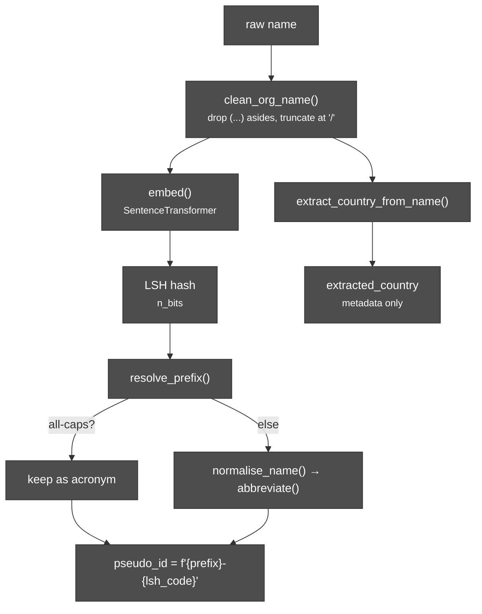

# Organisation-IDs

# Org Name → Pseudo-ID: no-code interface

A small web app wrapped around `pseudo_id_pipeline.py`. Someone with no
coding background can open it in a browser, upload a CSV, pick which
column has the organisation name, click a button, and download the same
file with a `pseudo_id` column added.

## Files
- `pseudo_id_pipeline.py` — the actual matching/ID logic (unchanged from before).
- `app.py` — the Streamlit interface.
- `requirements.txt` — dependencies.

## Run it yourself (one-time setup, then reusable)
```
pip install -r requirements.txt
streamlit run app.py
```
This opens a local browser tab at `http://localhost:8501`. Anyone on the
same machine can use it from there — no code, just clicking.

## Share it with other users
Pick whichever fits your setup:

1. **Streamlit Community Cloud (free, easiest for a small team)** —
   push these three files to a GitHub repo, then connect the repo at
   share.streamlit.io. You get a public/shareable URL, no server to manage.
2. **An internal server** — if OCHA/your org has somewhere to run a
   long-lived Python process (a VM, an internal app platform), run the
   same `streamlit run app.py` command there instead of on your laptop,
   and share that internal URL.
3. **Just you, for now** — run it locally whenever someone sends you a
   file, per the command above.

## What makes this safe to hand to other users
- Uploaded files are **never written to disk or sent anywhere** — they
  live only in that browser session's memory and vanish on refresh/close.
- The only outbound network call the app makes is a one-time, cached
  download of the public ISO country-name list used for detection — never
  the user's uploaded data.
- The pipeline only **adds** columns (`pseudo_id`, `lsh_code`,
  `extracted_country`, `pseudo_id_created_at`); it never edits or drops
  original columns, and the app keeps the original name column pinned
  next to `pseudo_id` in both the on-screen preview and the row-lookup
  tool, so anyone can check the mapping back to source data at any time.



